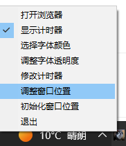
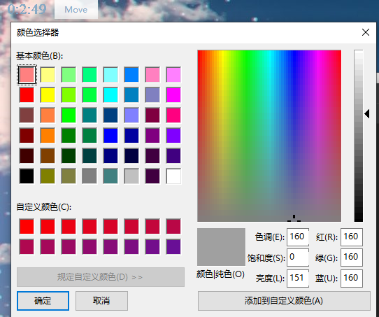
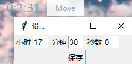
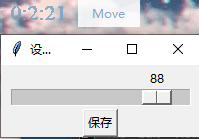
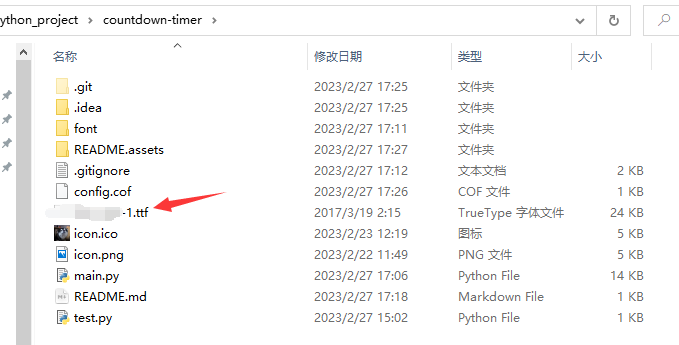
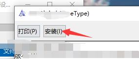

# countdown-timer
基于python-tkinter界面的倒计时工具

## UI

## 移到

## 字体颜色选择

## 倒计时设置

## 修改字体透明度

## 选择字体

字体文件放在同级目录下，并安装

## Auto Timesheet

自动提交 Toppan 时间表，托盘菜单 "Auto Timesheet" 配置：

- **Enabled**: 启用/禁用每日自动提交
- **Settings...**: 配置用户名、密码、项目、任务、每日小时数、执行时间、CA 证书路径、强制重交
- **Run Now**: 立即手动执行一次
- **Last**: 显示上次执行时间和结果

CA 证书默认使用同目录下的 `toppan-ca-bundle.pem`。调试 HTML 输出和日志位于 `timesheet_debug/` 子目录。脚本来源：`auto_timesheet.py`（独立可执行：`python auto_timesheet.py --help`）。